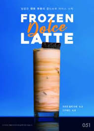

# 댄싱컵 딥라떼 전략 관련 리서치 - 석환

- 리서치 내용
    
    [1] 딥라떼 정의·스토리를 풍부하게 만들 레퍼런스
    
    - 메뉴 정의를 잘 풀어낸 카페 / 우유 블렌딩 같은 기술을 콘텐츠로 풀어낸 사례 / "깊이"라는 추상 어휘를 메뉴 정체성으로 안착시킨 케이스
    
    [2] 메뉴 라인업 보강 — 아몬드·솔티드 더 깊게 + 더 좋은 후보 검토
    
    - 아몬드·솔티드 운영 사례 / 더 나은 대체 후보 검토 (피스타치오·헤이즐넛·말차·우베·미소·흑임자 등)
    
    [3] "부산 딥라떼" 키워드 뒷받침
    
    - 부산이라는 도시 자체의 표현·콘텐츠화 (잡지·다큐·로컬 브랜드) / 동네 단위 어휘 (해운대·광안리·자갈치·기장·송정) / 부산 카페 씬 (스페셜티 외 대중 가격대까지) / 도시명을 메뉴화한 시도 평가
    
    [4] 딥라떼 시각화 — 컵·페어링·POP 디자인 풀
    
    - A. 컵 (마블링·그라데이션·도시 패턴·손님이 컵을 재활용·전시한 케이스) / B. 페어링 디저트 (솔티드 휘낭시에·해염 마들렌·라떼와 묶어 운영하는 시즈널 디저트) / C. POP·메뉴판 (신메뉴 매장 비주얼·"한정·시즌" 어휘 시각화)
    
    [5] 앰버서더 모집 — 한국 운영 케이스
    
    - 한국 카페·F&B 알바 콘텐츠 운영 사례 (메가·이디야·로컬·뷰티) / 인센티브 금액·콘텐츠 권한·6개월 유지 조건 / 5-10명 단위 소집단 운영 / 모집 폼 (허들↓ + 양질 거른 케이스) / 조회수 보너스 같은 동력 인센티브

# **딥라떼·부산 딥라떼 메뉴 브랜딩 및 앰버서더 레퍼런스 리서치**

## **1. "딥" 콘셉트를 잘 풀어낸 메뉴·브랜드 레퍼런스**

## **1-1. 딥라떼/딥카페라떼 자체를 시그니처로 만든 사례**

- 
    
    여기서 공통적으로 보이는 건, 단순히 ‘진한 라떼’라고 말하지 않고 각 브랜드가 자기만의 방식으로 **왜 깊은지**를 설명하고 있다는 점입니다.”
    
    우지커피는 **특별한 로스팅 기법 + 원유의 부드럽고 고소한 풍미와 반복 구매형 시그니처로 운영하고** , 하이오커피는 자기 브랜드만의 숙성 우유를 사용한다는 점 , 카페051은 작은 컵의 밀도감으로 차별화했습니다.
    
    그래서 댄싱컵도 딥라떼를 **진한 라떼가 아니라, 짧게 뽑은 샷, 설계된 우유, 오래 남는 여운**이런 식으로 딥의 이유를 만들어주는 게 중요하다고 봤습니다.”
    

- **우지커피(OOZY COFFEE) – 딥카페라떼**
https://oozycoffee.com/index/?bmode=view&idx=14927087
    - 브랜드 공식 사이트에서 "딥카페라떼 우지커피 시그니처 메뉴"로 명시, 진한 에스프레소와 우지커피만의 레시피로 만든 "시그니처 밀크"가 만나 한층 더 진하고 고소한 커피라고 정의한다.
    - 단순히 “진한 라떼”라고 하지 않고, **특별한 로스팅 기법 + 원유의 부드럽고 고소한 풍미**로 설명
    - 누적 600만 잔 판매 수치를 공개하며, 딥카페라떼를 단순 신메뉴가 아니라 브랜드의 **반복 구매형 시그니처로 운영**했다는 점
- **하이오커피 – 딥카페라떼**
https://hiocoffee.com/bbs/board.php?bo_table=03_02&sca=COFFEE
    - 메뉴 정의: "**하이오만의 숙성 우유를 사용**하여 고소하고 깊은 맛의 라떼"로 정의, HOT/ICE 모두 같은 정의를 반복해 **숙성 우유=깊은 맛**이라는 등식을 심는다.
    - 확장 포인트: 같은 페이지 안에 말차 크림 라떼, 믹스커피 등 다른 메뉴와 함께 배치하면서도, 딥카페라떼만 숙성 우유를 강조해 차별적 포지셔닝.
- **와커피(WA’COFFEE) – 딥라떼**
https://wacoffee.net/menus
    - 메뉴 구조: 공식 사이트의 커피 카테고리 **최상단에 "딥라떼"**를 두고, 그 다음에 와라떼·아메리카노·콜드브루 라인업이 이어지는 구조로 설계해 시그니처 역할을 부여.
    - 콘셉트: 세부 레시피 설명은 짧지만, "7% 스페셜티, 독창적인 시그니처 메뉴"라는 상단 카피로 딥라떼를 브랜드 개성의 핵심 축으로 둔다.

- **카페051 - '라떼더해운대'**
    - **10온스(약 283ml)의 작은 사이즈로 제공**하여 맛의 **응축감과 밀도**를 시각적·미각적으로 정의
    - '딸기 우유'라는 **일반적인 명칭 대신 '설향'이라는 특정 딸기 품종을 강조**한 '설향우유'를 선보여 원료의 우수성과 브랜드의 전문성을 메뉴 정의에 담음

- **커스텀커피(원두) - '딥 플레저(Deep Pleasure)'**
    - **원두 명칭을 통해** 고객이 커피를 마시는 순간 느낄 수 있는 '진한 기쁨'이라는 감성적 가치를 메뉴 정체성으로 투영

- **벤티프레소 - 숙성라떼**
    - 시간이 만들어낸 맛”, “우유에 식물성 생크림을 더해 천천히, 조심스럽게 숙성한다”, “**3일간 저온에서 천천히 숙성한다”는 식으로 공정을 전면에 강조**
    - **시간·정성·지속되는 여운**으로 설명한 점이 특징이며, 브랜드 소개 문구도 “깊이 있는 경험”으로 연결

## **1-2. 우유 블렌딩 기술을 콘텐츠로 풀어낸 사례**

- **유튜브 바리스타 채널 – 블렌딩 우유·숙성 우유 콘텐츠**
https://youtu.be/hcXbGk2L2Ek?si=QcreQrZhy4N04tBh
    - 에이스빈, 임종명 등 바리스타 크리에이터들이 **블렌딩 우유로 풍미가 폭발하는 라떼**, **숙성 우유 블렌딩 기법** 등을 주제로, 레시피와 이론을 동시에 설명하는 **영상 콘텐츠를 제작**.
    - 예시 1: "블렌딩우유로 풍미가 폭발하는 묵직한 카페라떼" 영상에서, 우유와 소프트믹스를 일정 비율로 섞어 **전용 블렌딩 우유**를 구축하고, 이 우유로 카페라떼·바닐라라떼를 만드는 과정을 상세 레시피로 공유한다.
    - 예시 2: "10명 중 10명이 좋아하는 카페라떼 우유"에서 우유, 아몬드 시럽, 생크림, 천일염을 조합한 블렌딩 우유를 제안하며, 묵직하지만 느끼함을 줄이기 위한 비율 설계 과정을 보여준다.
    - 예시 3: "숙성우유 블렌딩 기법" 영상은 유지방 함량과 우유 종류에 따른 라떼 맛 차이를 비교하며, 밍밍한 라떼를 "인생 라떼"로 만드는 과학적 접근을 강조한다.

## **2. 아몬드·솔티드 및 라인업 확장 레퍼런스**

- 
    
    “아몬드브리즈 바리스타 레시피 사례를 보면, 아몬드 베이스에 에스프레소를 레이어링하거나 솔티드 카라멜을 더해서 **고소함과 단짠 밸런스**를 강조하고 있었습니다. 이건 딥라떼에서도 아몬드를 단순 고소한 맛이 아니라, 부드럽고 깊은 베이스로 풀 수 있다는 점에서 참고할 만했습니다.”
    
    “솔티드 쪽은 텐퍼센트 커피의 솔티드 밀크 카라멜이나 더티 땅콩 라떼처럼, **견과류·크림·솔티드** 조합으로 확장되는 사례가 있었습니다. 단짠 조합은 대중적으로 이해가 쉽고, 특히 부산 딥라떼와 연결했을 때 바다·해염·짭짤한 여운 같은 키워드로 풀기 좋아 보였습니다.”
    
    “추가 후보로는 피스타치오, 흑임자, 말차, 우베 등을 봤는데요. 피스타치오는 고소함과 트렌디한 컬러감이 강해서 시즌 메뉴나 프리미엄 라인으로 좋고, 흑임자는 한국적인 고소함과 ‘깊은 맛’이 잘 맞아서 딥라떼 확장 후보로 가장 안정적이라고 봤습니다.”
    
    “말차는 이미 하이오커피처럼 딥카페라떼와 함께 우유 기반 시그니처로 확장하는 사례가 있고, 우베는 디저트39처럼 비주얼 임팩트가 강한 후보입니다. 다만 말차나 우베는 딥라떼의 ‘깊이’보다는 컬러와 트렌드성이 더 강해서, 메인보다는 시즌성으로 보는 게 맞을 것 같습니다.
    

## **2-1. 아몬드·솔티드 계열 메뉴 운영 사례**

- **아몬드브리즈 x 바리스타 레시피 (카페 레시피 아카이브)**
    - Coffeetv 등에서 아몬드브리즈 바리스타 블렌드를 활용한 카페 메뉴 레시피를 제안, "카페 아몬드 브리즈"와 "솔티드 아몬드 카라멜 마끼아또" 등에서 아몬드와 솔티드 카라멜 조합을 제시한다.
    - 레시피: 아몬드 브리즈를 차갑게 만들고 에스프레소 프라페와 레이어링하는 방식, 솔티드 카라멜 파우더를 스티밍한 후 토핑으로 솔티드 카라멜 파우더를 다시 뿌리는 방식 등으로 **비주얼 레이어와 단짠단짠 밸런스**를 강조한다.
- **메가커피 – 피스타치오 포레스트 라떼**
    - 시즌 메뉴: 겨울 시즌 한정으로 **피스타치오 라떼에 블렌딩 커피를 추가**한 피스타치오 포레스트 라떼를 출시, 고소함과 겨울 시즌 이미지를 동시에 묶는다.
    - 포인트: "고민 없이 선택하는 메뉴 카페라떼"와 함께 추천되는 구조로, 기본 라떼와 피스타치오 라떼를 짝지어 라인업을 구성한다.
- **텐퍼센트 커피 – 솔티드 밀크 카라멜, 더티 땅콩 라떼 등**
    - 블로거 후기에 따르면 텐퍼센트 커피는 솔티드 밀크 카라멜, 더티땅콩라떼 등 **견과류+솔티드+크림** 조합의 시그니처 메뉴를 지속적으로 확장하며 재구매 후기를 쌓고 있다.
- **기능성 음료 사례 (베러먼데이)**
    - 부산 스타트업 브랜드인 '베러먼데이'는 아**몬드에 오르니틴 성분을 더한 '숙취라떼'를 운영**하고 있습니다. 이는 단순한 맛의 조화를 넘어 '직장인의 건강한 월요일'이라는 브랜드 철학을 기능적 메뉴로 풀어낸 사례
- **식물성 대체유 사례 (스타벅스):**
    - 스타벅스는 'Almondmilk Honey Latte'나 'Sugar Cookie Almondmilk Latte'와 같이 아몬드 브리즈(식물성 우유)를 베이스로 한 메뉴를 운영합니다. 이는 비건 및 웰빙 트렌드에 대응하는 동시에 부드러운 견과류의 풍미를 제공하는 방식

## **2-2. 라인업 확장 – 피스타치오·흑임자·말차 계열 참고**

- **피스타치오 라떼 – 트렌드 키워드로서의 활용**
    - 메뉴 기획 스튜디오 셀플러스는 "전지적 카페 시점_ 피스타치오 라떼"라는 상품 설명에서 **2026년 트렌드 키워드, 피스타치오**를 활용한 시그니처 메뉴 제안을 한다고 밝힌다.
    - 설명에서 피스타치오는 고소한 풍미와 트렌디한 컬러감을 동시에 갖춘 재료로, 시그니처 라떼에 적합하다고 강조된다.
- **흑임자 라떼 맛집 5곳 – 할매니얼·고소함 키워드**
    - 에스크와이어 코리아 기사에서는 서울의 흑임자 라떼 맛집 5곳을 소개하며, **카페 이로, 디프커피온더바, 베티버 성수, 레인리포트, 코페드팔레츠** 등이 흑임자 크림 라떼, 세서미 클라우드 등 흑임자 기반 시그니처를 운영하는 것으로 소개된다.

- **말차 크림 카페라떼 – 하이오커피**
    - 하이오커피는 딥카페라떼와 함께 "부드러운 우유와 깊은 에스프레소 위에 진한 제주산 말차 크림을 더한 음료"로 말차 크림 카페라떼를 운영한다.
    - 딥카페라떼(숙성 우유), 말차 크림(색과 풍미), 믹스커피(향수) 등으로 **우유 기반 시그니처들을 여러 축으로 확장**하는 구조다.

- **탐앤탐스 - 브랜드 협업 및 라인업 확장**
    - 탐앤탐스는 '솔티드카라멜 레볼루션 3종'을 통해 솔티드카라멜을 **다크초코, 말차, 홍차**와 결합하는 실험적인 라인업 출시
    

- **할리스 - 솔티카라멜크림 라떼**
    - 단짠 조합을 "더욱 진한 풍미의 딥 라떼"로 연결하여 운영하고 있으며, 이는 딥라떼 브랜드와의 언어적 궁합이 매우 높은 것으로 평가
    

- **디저트 39 - 우베**
    - 자색 고구마의 보라색 색감과 크리미한 질감이 딥라떼의 비주얼 → 말차(초록)에 이어 보라색이 트렌드라는 콘텐츠 많이 봄
    - https://www.instagram.com/reel/DXOUFGTkTuU/?utm_source=ig_web_copy_link&igsh=MzRlODBiNWFlZA==
    - https://www.instagram.com/reel/DXEQdcQEpzF/?utm_source=ig_web_copy_link&igsh=MzRlODBiNWFlZA==

## **3. 부산·지역명 메뉴화 및 "부산 딥라떼" 레퍼런스**

- 
    
    “세 번째는 ‘부산 딥라떼’라는 키워드가 억지스럽지 않은지 봤습니다. 부산은 이미 바다, 항구, 로컬 카페, 커피도시 같은 이미지가 있고, 부산 카페 씬도 전포, 해운대, 영도, 온천천, 명지처럼 동네별로 무드가 뚜렷합니다.”
    
    “도시명을 메뉴화한 사례도 참고했습니다. 예를 들어 스타벅스는 제주 메뉴에서 ‘제주 까망 크림 프라푸치노’, ‘제주 비자림 콜드 브루’처럼 지역명과 장소 이미지를 같이 사용했고, 블루보틀 NOLA는 뉴올리언스라는 도시명을 치커리 커피라는 지역 레시피와 연결했습니다.”
    
    “그래서 ‘부산 딥라떼’도 그냥 부산이라는 이름만 붙이기보다,**부산 바다의 짭짤함, 항구도시의 밀도감, 밤바다의 깊이** 같은 감각으로 풀어야 한다고 봤습니다.”
    
    “예를 들면 ‘부산 딥 솔티드’, ‘광안 해염 딥라떼’, ‘송정 브리즈 딥라떼’처럼 도시명이나 동네명에 맛의 단서를 붙이는 방식이 더 좋을 것 같습니다.”
    

## **3-1. 부산 카페씬의 키워드와 감도**

- **부산 카페 전반**
    - **여행 서비스 트리플**은 "SNS에서 핫한 부산 카페" 기사에서 **전포 카페 거리, 온천천 카페 거리, 명지동 리버뷰 카페 등 부산의 카페 씬을 소개**하며, 뷰·사진·브런치·시그니처 라떼를 핵심 매력으로 꼽는다.
    - **카페 진목**의 경우 낙동강 앞 리버뷰와 흰 파라솔이 어우러진 야외 좌석, 진목 라떼와 크루와상 베이커리의 조합이 대표성 있게 소개된다.
- **해운대·영도 등 로컬 무드**
    - 해운대 오션뷰 카페 워킹홀리데이는 해운대역 인근 오션뷰·브런치·라떼 맛집으로 다수의 블로그 후기가 있으며, 뷰와 메뉴의 페어링을 강조한다.
    - 영도 도시재생 카페 무명일기는 1950년대 창고를 살린 대형 카페로, 항만·산업 도시 부산의 과거와 현재를 연결하는 공간으로 소개된다.

⇒  **부산=바다 뷰·강 뷰·산업항의 거친 풍경과 뉴트로 도시재생**이라는 이미지 축을 제시

## **3-2. 도시·동네명을 메뉴화한 사례**

- 카페 051(지역 번호)', '라떼더해운대(지역명)', '설향우유(품종명)' 사례처럼 구체적인 로컬 키워드는 고객에게 즉각적인 소속감과 품질에 대한 신뢰를 제공
- **진목 라떼(카페 진목, 부산)**
    - 부산 명지동 카페 진목은 낙동강 리버뷰와 함께 **진목 라떼**를 대표 메뉴로 내세우며, 지역명(진목)을 메뉴명에 쓰는 방식으로 장소성과 메뉴를 결합
    
    
    
    
    
- **보난자커피 – 서울라떼**
    - 독일 베를린에서 시작한 스페셜티 브랜드 보난자가 한국에 진출하며 서울라떼, 베를린 모카
    - **본사는 베를린이지만, 한국 지점에서는 서울이라는 도시명을 붙인 시그니처를 만들고,** **고소함·부드러움·디카페인 가능** 등의 특성을 강조해 "서울에서 마시는 부드럽고 세련된 라떼" 이미지를 구축한다.
    
    
    
- **스타벅스 - "제주" 사례: 방언과 명소를 통한 '정서적 깊이' and “서울 석양 오미자 피지오”, “서울 막걸리향 콜드 브루”**
    
    
    
    - 스타벅스 코리아는 단순한 지역명을 넘어, 제주의 장소자산(Place Asset)과 **언어적 특색**을 결합해 깊이 있는 서사를 구축
    - 제주 까망 크림 프라푸치노', '제주 비자림 콜드 브루'와 같이 지역 명소를 메뉴명에 넣거나, '새코롬 돌코롬'과 같은 **제주 방언**을 활용
    - 소비자에게 일상에서 탈피해 낯선 여행지에 있다는 '장소애(Topophilia)'를 불러일으키며, 단순히 맛이 진한 것이 아니라 '청정함'과 '힐링'이라는 정서적 깊이를 제공
    
    
    
- **카페 051 - 라떼더 해운대**
    - 10온스(약 283ml)라는 **응축된 사이즈**와 코코넛밀크/크림의 쫀쫀한 질감을 통해 부산 바다의 밀도감을 시각적·미각적으로 증명
- **블루보틀 - 뉴올리언스 스타일**
    - 단순히 도시 이름을 붙인 것이 아니라, **해당 지역의 커피 문화인 '치커리'라는 구체적인 레시피 배경이 있어 이름 자체가 설명**
    
    
    

→ 잡지 '다시, 부산'이 부산의 소박한 진짜 이야기를 발굴해 팬덤을 형성했듯, 딥라떼 또한 부산의 동네별 특성을 맛의 깊이로 재해석하여 로컬 주민의 자부심을 자극하는 전략? 
ex) “자갈치 딥라떼”처럼 직설적으로 쓰기보다 “항구 소금”, “시장 밤바다”, “자갈 파도” 같은 간접 메타포

→  "부산의 바다·시장·야경이 겹쳐진 한 잔”이 생각날 수 있는 네이밍과 그에 맞는 콘텐츠 제작하는 방향성? 

- 서울라떼는 "라떼를 잘 안 마시는 사람도 중독됐다"는 후기 등 강한 호감 평가가 누적되어 시그니처로 자리 잡았고,
- 진목 라떼는 리버뷰와 함께 사진이 많이 공유되며, 크루와상 등 베이커리와 함께 주문되는 조합으로 소개되어 **뷰+메뉴 패키지** 형태의 반응을 끌어낸다..

## **4. 딥라떼 시각화 – 컵·페어링·POP 디자인 레퍼런스**

#### A. 컵

#### B. 페어링

#### C. POP

## **5. 앰버서더·크리에이터 프로그램 운영 레퍼런스**

## **5-1. 카페·커피 브랜드 중심 앰버서더/크리에이터/서포터즈 사례**

- **터미널 에스프레소 하우스 – 커피 크리에이터 2기**
    - 정통 이탈리아 에스프레소 카페 브랜드가 커피 크리에이터 2기를 모집, SNS 콘텐츠 제작과 카페·F&B 산업에 관심 있는 성인을 대상
    - **운영 구조:** 4개월 동안 블로그·SNS를 활용한 카페 리뷰 및 콘텐츠 제작, 커피 관련 행사 참가 및 취재, 각종 마케팅안 제안 등 미션을 수행한다.
    - **인센티브:** 매장 포인트 제공, 커피 관련 행사·교육 기회, 우수 활동자의 해외 커피 산업 견학 및 여행 전액 지원.
    - **포인트**: 알바·직원이 아니라 **외부 크리에이터를 선발**해, 브랜드 콘텐츠 풀과 마케팅 아이디어를 확장하는 구조.
    - 터미널 에스프레소 하우스의 경우, 커피 크리에이터 1기 활동 이후 2기를 추가 모집하는 것으로 보아, 일정 수준 이상의 긍정적 효과(콘텐츠 생산, 브랜드 인지도 제고, 매장 방문 유도 등)를 확인했기 때문에 프로그램을 지속·확장하는 것으로 해석
- **이디야커피 메이튜**
    - : 브랜드 내부 경험자(스태프) 중 1명을 선발하여 6개월간 운영하는 소수 정예 모델
    - 활동 장학금 100만 원과 매달 제품 지원, 특히 **입사 지원 시 가산점**이라는 강력한 혜택을 제공하여 브랜드 로열티가 높은 내부 인적 자원을 마케팅 자산화
- **달리는 커피 - 달커즈**
    - 브랜드의 팬을 '크루'로 전환하여 발대식과 체험형 온보딩을 진행하며, 팬덤을 기반으로 한 홍보 콘텐츠를 생산
- **더벤티 - 벤티보라**
    - 19~24세 대학생을 주 타깃으로 설정하여, Z세대와 **진정성 있는 소통**을 목표로 기수제 서포터즈를 운영
        
        